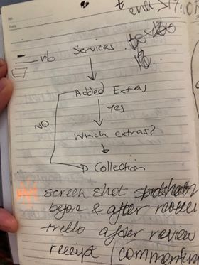

// A link to your github repository
    
    Github Repo link: https://github.com/jackdwalker/puppy-parlour/

// Description of the app, including:

    *Purpose:*

    We created the Puppy Parlour so that everyone in Brisbane can have access to pooch pampering at a reasonable price

    *Ideation:*

    We wanted to create an app that would allow users to book a grooming service, along with optional extra services. We wanted to allow them to book services for multiple dogs. We also wanted to add puppy-sitting as a stand alone service and to make it an easy option for users to get further care of their dog on the day of service, in the event that they were not available to pickup their pooch at the designated pickup time. We thought this would all be possible in the two days provided top create the app.

    *Consideration for Design:*

    We each asked our friends and family about the puppy grooming services that they had used for their dogs.
    
     1. We asked a variety of questions: What grooming services had they used? Did they find it a good value for money? What cost too much? Does their dog come back happy and pampered? Were there any things you didn't like about the puppy grooming services that you have tried? 

     2. We briefed them on our design and asked for feedback

     3. The receieved some feedback about dogs being in unrest during certain services, although this was outside of the scope of our booking service, as this is more related to staff/dog interaction in person.

     4. We thanked them for their feedback!

    *Iterations of Development:*

    As we developed our code we realised the functionality required within our code needed more complexity than originally scoped.

    Namely, we want to offer Puppy Sitting service included as an Extra Service to allow for Puppy Palour to keep the dog until the user was able to pick up their pet, say after work. We also wanted to offer Puppy Sitting services as an option of its own.  This meant we required two Puppy Sitting prices.  To do this we came up with a New Year offer of $10 for Puppy Sitting service when selected with another service.  Puppy Sitting when selected as a service on its own was offered at $50.

    As part of our idea, we wanted to include a time stamp to inform the user when their dog would be available for pickup. The time stamp is also utilised to determine if the Service selected fits in the Scheduled operions hours available for a given day. We would have liked to be shown to the user when services are choosen but this idea came too late to implement.

    *Ideas Future Iterations:*

    Proprieter Franchise/Location Profit:
        This was not implemented as we ran out time.

    Separate Invoices for Any Additional Dogs: 
        This is a limitation of the code. We ran out of time to implement a solution.

    *Functionality:*

    The purpose of our app is to allow users to book services and optional extras available at Puppy Parlour. We also provide a puppysitting service in the event that the user isn't available at the designated pickup time given the service they selected. The app then prints an invoice based on services and extras selected.

    *Instructions for use:*

    1. Install terminal-table gem
        1. Use: sudo install gem terminal-table
    2. Run ruby puppyparlour.rb (Make sure you are in the folder containing the file i.e. ./src/)
    3. Follow the prompts
    
    *Screenshots of Code in Use:*

// Details of the design and planning
    Images showing our planning and brainstorming session:

    Flowcharts detailing flow of app processes (We had multiple iterations as our app was developed, they were updated to reflect this):

    Testing Spreadsheet iterations:

   
   
   
   

    Screenshots of Trello Board and its iterations:

    Evidence of Slack Conversations:

